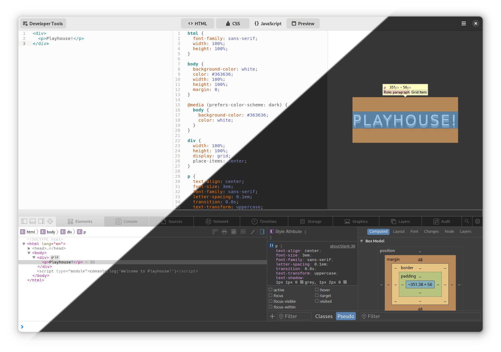

# Playhouse

A playground for HTML/CSS/JavaScript



<a href='https://beta.flathub.org/apps/details/re.sonny.Playhouse'></a>

## About

Playhouse make it easy to prototype, teach, design, learn and build Web things.

Features:

- HTML/CSS/JavaScript editors
- live Web preview
- auto-save
- standard keyboard shortcuts
- developer tools
- dark/light mode support

## Tips an tricks

### How can I use a library?

Use https://unpkg.com/ and dynamic imports in the `JavaScript` panel.

```js
// Example of loading a library that supports ES modules
import("https://unpkg.com/date-fns@2.29.3/esm/index.js?module")
  .then((datefns) => {
    console.log(datefns.add(new Date(), { days: 2 }));
  })
  .catch(console.error);

// Example of loading a library that registers on the global object
import("https://unpkg.com/jquery@3.6.1/dist/jquery.js")
  .then(() => {
    $("p").hide();
  })
  .catch(console.error);
```

## Development

Use [GNOME Builder](https://apps.gnome.org/app/org.gnome.Builder/).

Press Ctrl+Shift+D for the GTK inspector.

## Credits

Playhouse would not be possible without

GTK, GLib, Flatpak, GtkSourceView, libadwaita, GJS, Blueprint, WebkitGTK

and the GNOME community 🖤

## Copyright

© 2022 [Sonny Piers](https://github.com/sonnyp)

## License

GPLv3. Please see [COPYING](COPYING) file.
